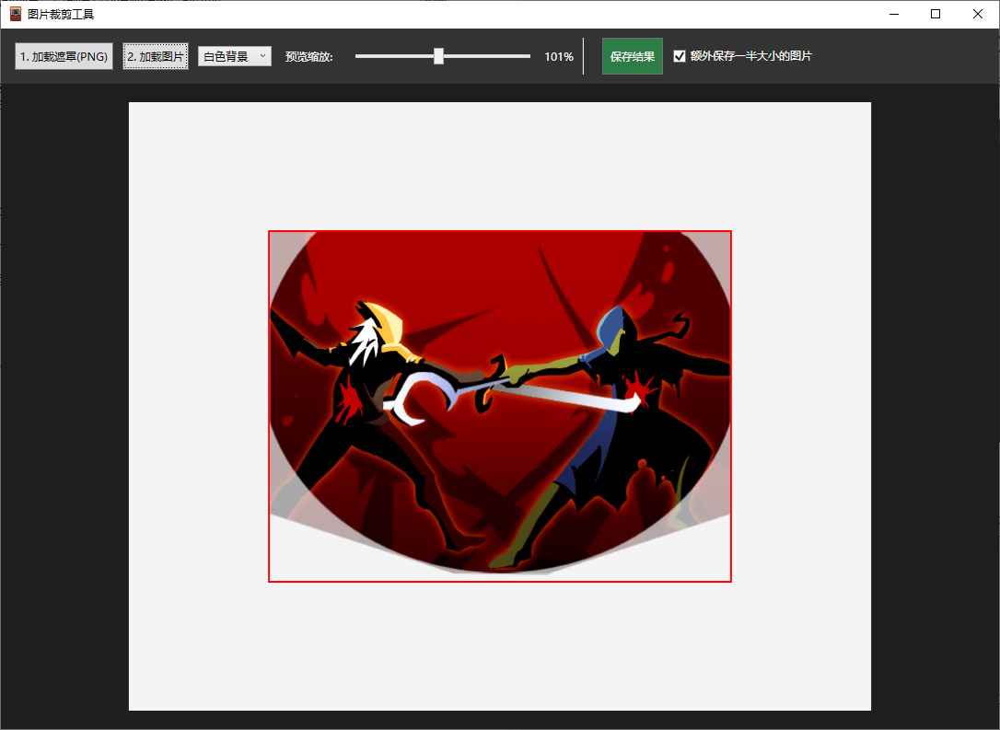

# StsModAssist - 杀戮尖塔 MOD 辅助工具

本软件用于解决本人在开发杀戮尖塔mod时候出现的琐事。目前有且仅有处理图片的功能。

## 功能介绍

1. 加载遮罩：点击“加载遮罩”，选择一张png图片，会自动计算不透明区域作为遮罩。
2. 加载图片：点击“加载图片”，导入你的卡牌卡面图片。
3. 调整位置：

> * 移动：鼠标按住左键拖动。
> * 旋转：鼠标按住右键拖动。
> * 缩放：按住 Ctrl 滚动轮缩放图片。
> * 缩放画布：按住 Alt 滚动轮缩放整个画布。

4. 导出：点击“保存结果”，选择保存路径。导出红框大小的图片，除遮罩外部分都是透明的。如需同时生成小图，请勾选 _额外保存一半大小的图片_。
5. 画布背景：现有白色、灰色、和经典棋盘背景。

## 作者的话

第一次写WPF，基本上是边问AI边写出来的小东西。感觉代码结构也乱七八糟的，不过懒得优化了拢总也才三百多行代码。
如果这个工具能帮到你，那就再好不过了。

## 许可协议

本项目遵循 **GNU General Public License v3.0 (GPLv3)** 开源协议。
